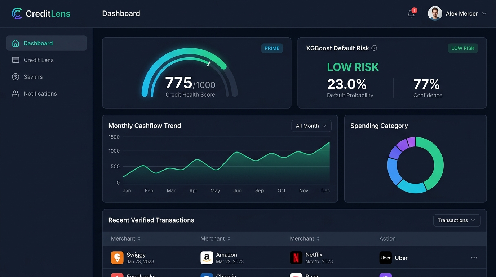
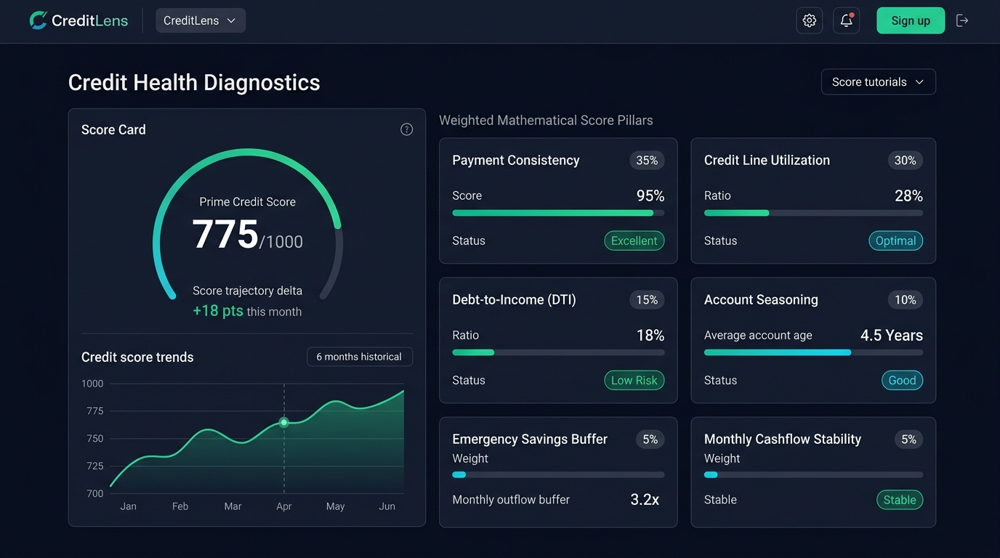
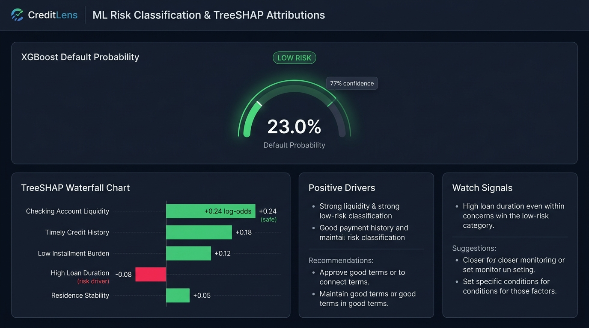
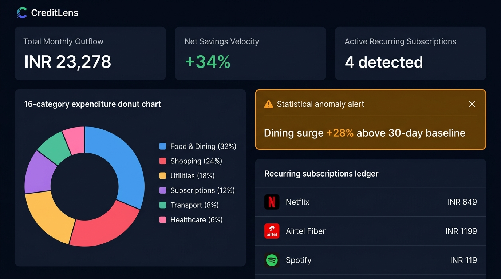
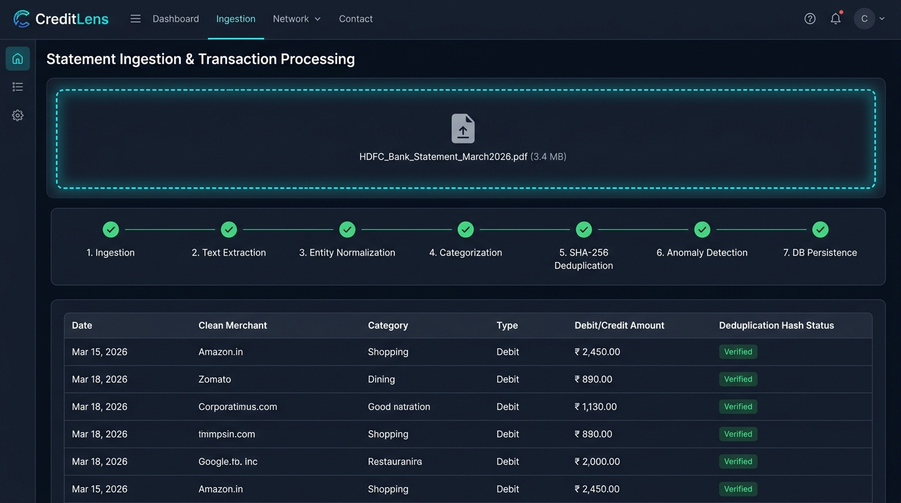
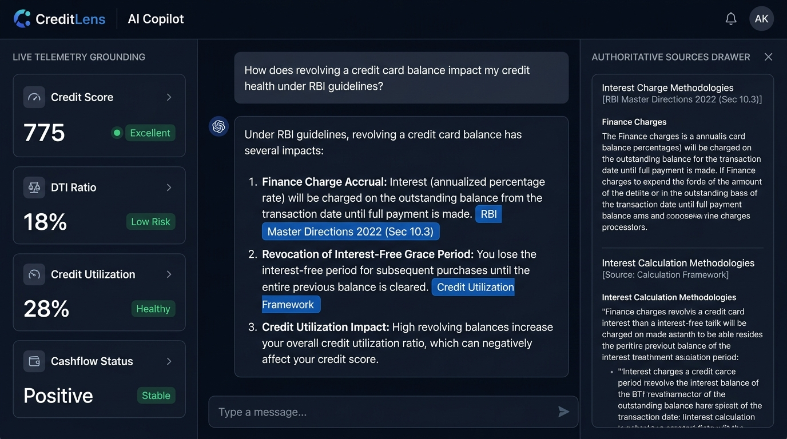

# CreditLens — AI-Powered Credit Risk & Financial Intelligence Platform

[](https://github.com/AnkitMishra28/AI-Powered-Credit-Risk-Financial-Intelligence-Platform/actions/workflows/ci.yml)
[](https://fastapi.tiangolo.com)
[](https://nextjs.org)
[](https://react.dev)
[](https://www.postgresql.org)
[](https://xgboost.readthedocs.io)
[](https://ai.google.dev)

CreditLens is a full-stack fintech platform that combines deterministic credit-health scoring, explainable machine learning default risk prediction, financial statement ingestion, spending intelligence, and a grounded regulatory AI copilot.

Unlike generic financial dashboards or unstructured LLM wrappers, CreditLens enforces strict architectural boundaries: all calculations and financial metrics are executed deterministically in Python, default risk is predicted via XGBoost and explained using local TreeSHAP attributions, and the conversational assistant synthesizes answers grounded in official Reserve Bank of India (RBI) regulatory directives and verified user telemetry.

---

## Screenshots

| Dashboard Command Center | Credit Health Diagnostics |
| :---: | :---: |
|  |  |

| ML Risk Analysis & TreeSHAP | Spending Intelligence & Anomalies |
| :---: | :---: |
|  |  |

| Statement Ingestion & Ledger | AI Copilot (RAG & Grounding) |
| :---: | :---: |
|  |  |

---

## How It Works

The platform coordinates specialized subsystems across an end-to-end user journey:

```
[ Bank Statements (PDF/CSV) ] ──► [ Parser & Normalizer ] ──► [ SHA-256 Deduplication ] ──► [ PostgreSQL 16 ]
                                                                                                  │
                                 ┌────────────────────────────────────────────────────────────────┤
                                 ▼                                                                ▼
                     [ 0–1000 Credit Health ]                                        [ Spending & Anomalies ]
                     Deterministic 6-Factor Engine                                   Category Velocity & Outliers
                                 │                                                                │
                                 ▼                                                                ▼
                     [ XGBoost + TreeSHAP ]                                          [ RAG Knowledge Retrieval ]
                     Default Probability & Attributions                              RBI Master Directions 2022
                                 │                                                                │
                                 └──────────────────────────────┬─────────────────────────────────┘
                                                                ▼
                                                [ Grounded Prompt Construction ]
                                                                │
                                                                ▼
                                                [ Gemini 1.5 Synthesis + Citations ]
                                                                │
                                                                ▼
                                                [ Next.js 16 Dark Fintech UI ]
```

1. **Authentication**: User logs in with bcrypt-verified credentials, receiving a signed JWT access token.
2. **Deterministic Credit Diagnostics**: The backend calculates a 0–1000 behavioral Credit Health Score across 6 weighted factors (payment consistency, credit utilization, debt-to-income, account seasoning, savings buffer, and monthly cashflow stability).
3. **ML Risk Prediction**: Applicant profile parameters are evaluated by a trained XGBoost classifier to compute calibrated default probability.
4. **TreeSHAP Explainability**: Local Shapley values identify top risk-mitigating features (e.g., checking liquidity) and watch signals (e.g., loan duration).
5. **Statement Ingestion**: User uploads CSV/PDF bank statements. The ingestion pipeline cleans merchant entities, applies SHA-256 fingerprint deduplication, and persists canonical ledger entries.
6. **Spending Intelligence**: Statistical anomaly algorithms detect category velocity surges (>25% over rolling baseline) and identify recurring subscriptions.
7. **RAG Copilot Inquiry**: When asking complex regulatory questions (e.g., APR compounding or minimum payment calculations), the engine retrieves relevant passages from indexed RBI directives, injects the user's verified financial metrics, and prompts Gemini to produce a structured answer with source citations.

---

## Machine Learning & TreeSHAP

```
Applicant Features ──► Preprocessing Pipeline ──► XGBoost Classifier ──► Default Probability ──► TreeSHAP ──► Risk Drivers
```

### Framing & Dataset
- **Dataset**: South German Credit Benchmark (*Groemping, 2020 / UCI Machine Learning Repository*).
- **Target**: Binary credit default classification (`0`: Good / Non-Default, `1`: Bad / Default).
- **Preprocessing**: `ColumnTransformer` with `StandardScaler` for continuous numerical features and `OneHotEncoder` for categorical attributes.
- **Model**: `XGBoostClassifier` calibrated to predict the probability of default $P(\text{Default} \mid X)$.

### Test Evaluation Metrics (200 Stratified Test Samples)

| Metric | Logistic Regression (Baseline) | XGBoost Classifier (Primary) |
| :--- | :---: | :---: |
| **Accuracy** | 75.00% | **75.50%** |
| **Precision (Default Class)** | 55.68% | **57.75%** |
| **Recall (Default Class)** | **81.67%** | 68.33% |
| **F1-Score** | 66.22% | **62.60%** |
| **ROC-AUC** | 80.80% | **79.87%** |
| **PR-AUC** | 64.39% | **65.96%** |
| **Brier Score (Calibration)** | 0.1814 | **0.1715** |

### Local Explainability
Rather than returning an opaque risk score, `shap.TreeExplainer` computes exact local feature contributions at inference time, identifying positive contributors (e.g., liquidity scores) and negative watch drivers (e.g., installment burden).

---

## AI Copilot — RAG Architecture

```
User Question ──► Vector Similarity Search ──► Top Regulatory Chunks ──► Verified User Metrics ──► Prompt Context ──► Gemini ──► Answer + Citations
```

The Copilot is designed to reduce hallucination by grounding responses in authoritative regulatory documents and deterministic user telemetry:

- **Authoritative Sources**: Ingests official regulatory standards including *RBI Master Direction – Credit Card and Debit Card Issuance and Conduct Directions (2022)*, *RBI APR Compounding Guidelines*, and credit utilization frameworks.
- **Vector Retrieval**: Chunks documents with semantic overlap and indexes dense embeddings for cosine similarity retrieval.
- **Metric Grounding**: Automatically injects verified user telemetry (credit score, DTI, revolving utilization, cashflow status) into the prompt context as immutable facts. The LLM is never permitted to calculate financial numbers.
- **Safety Guardrails**: Intercepts prompt injection attempts (`Ignore previous instructions`) and out-of-scope inquiries.

---

## Database

CreditLens uses **PostgreSQL 16** with **SQLAlchemy 2.0** and **asyncpg** for persistent multi-tenant data storage, managed via **Alembic** migrations.

```
Users
 ├── Financial Profiles
 ├── Loans
 ├── Statements
 │     └── Transactions (SHA-256 Deduplicated)
 ├── Credit Health Snapshots
 │     └── Credit Health Factors
 ├── Risk Predictions
 └── Copilot Queries

Knowledge Base:
Documents ──► Document Chunks (Embeddings)
```

*For complete ER diagrams, table specifications, and recruiter demo SQL queries, see [`docs/database.md`](docs/database.md).*

---

## Tech Stack

| Layer | Technology | Purpose |
| :--- | :--- | :--- |
| **Frontend Framework** | Next.js `16.3.3` (App Router) | React server components, Turbopack bundling |
| **Frontend UI** | React `19.2.8`, Tailwind CSS `v4` | Dark-mode fintech UI, responsive layouts |
| **Data Visualization** | Recharts `3.10.1`, Lucide React | Financial trend charts, allocation donuts, radial gauges |
| **Backend API** | FastAPI `0.115.x`, Uvicorn | Async ASGI REST API with OpenAPI/Swagger docs |
| **Validation & Auth** | Pydantic v2, Python-JOSE, bcrypt | Type validation, JWT token signing, password hashing |
| **Database & ORM** | PostgreSQL 16, SQLAlchemy 2.0, asyncpg | Persistent relational storage, async I/O |
| **Migrations** | Alembic | Version-controlled schema migrations |
| **Machine Learning** | Scikit-Learn, XGBoost, SHAP, Joblib | Default risk classification and TreeSHAP explainability |
| **Generative AI & RAG**| Vector Similarity Search, Gemini API | Grounded regulatory synthesis and source attribution |
| **CI / CD** | GitHub Actions | Automated linting, migration testing, Pytest, Next.js build |

---

## Run with Docker

The entire platform can be run locally using Docker Compose:

```bash
# Start all services (PostgreSQL, FastAPI Backend, Next.js Frontend)
docker compose up --build
```

- **Frontend Application**: `http://localhost:3000`
- **Backend API & Swagger**: `http://localhost:8000/api/v1/docs`
- **PostgreSQL Database**: `localhost:5433` (Service: `db`)

---

## Run Locally

### Prerequisites
- Python 3.11+
- Node.js 20+
- PostgreSQL running locally or via Docker (`docker compose up -d db`)

### 1. Backend Setup
```bash
cd backend

# Windows PowerShell:
python -m venv .venv
.\.venv\Scripts\activate

# Linux/macOS:
# python3 -m venv .venv
# source .venv/bin/activate

# Install dependencies
pip install -r requirements.txt

# Run database migrations
alembic upgrade head

# Run automated tests (27 passed)
pytest -q

# Start FastAPI server on port 8000
python -m uvicorn app.main:app --reload --host 0.0.0.0 --port 8000
```

### 2. Frontend Setup
```bash
cd frontend

# Install dependencies using verified lockfile
npm ci

# Run linting & production build
npm run lint
npm run build

# Start Next.js development server on port 3000
npm run dev
```

### 3. Demo Credentials
The database automatically seeds a demo analyst account for quick evaluation:
- **Email**: `alex.mercer@fintech.demo`
- **Password**: `password123`
- *(Or use the 1-Click Demo Login button on `/login`)*

---

## API Highlights

Interactive documentation is available at `http://localhost:8000/api/v1/docs`:

| Group | Method | Endpoint | Description |
| :--- | :--- | :--- | :--- |
| **Health** | `GET` | `/api/v1/health/ready` | Deep readiness probe (Database, ML model, Vector store) |
| **Auth** | `POST` | `/api/v1/users/login` | Authenticates user, issues signed JWT access token |
| **Credit Health** | `GET` | `/api/v1/credit-health/summary` | Returns 0–1000 credit score and 6 weighted factor scores |
| **Risk & ML** | `GET` | `/api/v1/risk/analysis` | Calibrated XGBoost default risk probability and TreeSHAP deltas |
| **Statements** | `POST` | `/api/v1/statements/upload` | Ingests CSV/PDF statement, cleans merchants, deduplicates |
| **Spending** | `GET` | `/api/v1/spending/overview` | 16-category spending breakdown, anomalies, and recurring EMIs |
| **Copilot** | `POST` | `/api/v1/copilot/query` | RAG regulatory inquiry with RBI citations and metric grounding |

---

## Security

- **Cryptographic Password Hashing**: Passwords hashed using `bcrypt` with unique salts.
- **Signed JWT Tokens**: Stateless session authentication via `HS256` signed JWTs with expiration.
- **Tenant Data Isolation**: Database queries strictly derive `user_id` from authenticated token claims.
- **Input Validation**: Strict Pydantic v2 schemas validating request payloads and file uploads.
- **Security Headers**: Standard OWASP protection (`X-Content-Type-Options: nosniff`, `X-Frame-Options: DENY`, `HSTS`).
- **Rate Limiting**: Sliding-window rate limiters protecting authentication, statement upload, and AI query routes.

---

## Testing & CI

Continuous integration is enforced via [`.github/workflows/ci.yml`](.github/workflows/ci.yml):

- **Backend Validation**: Python 3.11 bytecode verification, temporary PostgreSQL service container, Alembic migration test, Pytest test suite, and end-to-end integration verification (`test_api.py`).
- **Frontend Validation**: Node.js 20 clean `npm ci`, ESLint check (0 errors), TypeScript check, and Next.js production build.

---

## Project Structure

```
.
├── backend/
│   ├── alembic/                 # Database migrations (Alembic)
│   ├── app/
│   │   ├── api/v1/              # API routes (auth, risk, credit-health, copilot)
│   │   ├── core/                # Security, JWT, config, rate limiting
│   │   ├── db/                  # Database session, repositories, base models
│   │   ├── ingestion/           # Statement parsing (CSV/PDF), normalizer, taxonomy
│   │   ├── ml/                  # XGBoost model, preprocessor, TreeSHAP explainer
│   │   │   └── artifacts/       # Saved joblib models and metadata.json
│   │   ├── models/              # SQLAlchemy ORM table models
│   │   ├── rag/                 # Vector store, chunker, Gemini client, prompt builder
│   │   └── schemas/             # Pydantic request/response schemas
│   ├── Dockerfile               # Backend Dockerfile (Python 3.11-slim)
│   ├── requirements.txt         # Backend dependencies
│   └── test_api.py              # Integration test suite
├── frontend/
│   ├── src/
│   │   ├── app/                 # Next.js 16 App Router pages
│   │   ├── components/          # Reusable fintech cards, gauges, and charts
│   │   ├── services/            # Centralized API service layer and DTO mappers
│   │   └── types/               # TypeScript interfaces
│   ├── Dockerfile               # Frontend multi-stage Dockerfile
│   └── package.json             # Frontend dependencies
├── docs/
│   ├── database.md              # Detailed schema, ER diagram, and demo queries
│   └── screenshots/             # Application UI screenshots
├── .github/workflows/ci.yml     # GitHub Actions CI/CD workflow
├── docker-compose.yml           # Full-stack container orchestration
└── README.md                    # Project documentation
```

---

## Engineering Highlights

- **Full-Stack Type Safety**: End-to-end consistency from Python Pydantic DTOs through central service mappers to TypeScript interfaces.
- **Strict Calculation Boundaries**: Financial metrics and 0–1000 scores are computed deterministically in Python; the LLM is restricted to grounded synthesis.
- **Explainable Machine Learning**: Native TreeSHAP integration explains why specific default risk tiers are assigned to applicants.
- **Automated Statement Hygiene**: Multi-format ingestion with merchant entity normalization and SHA-256 fingerprint deduplication.
- **Grounded Regulatory RAG**: Queries authoritative RBI directives and user profile metrics to deliver verifiable answers with citations.
- **Multi-Tenant Isolation**: Row-level tenant boundaries derived from verified JWT claims.
- **Containerized Orchestration**: Reproducible local and deployment environment via Docker Compose with PostgreSQL.

---

## Limitations

- **Benchmark Dataset**: The ML risk model is trained on the South German Credit benchmark dataset for educational and portfolio demonstration. Commercial banking deployment requires training on compliant, large-scale bureau data with disparate impact audits.
- **External AI Dependencies**: Copilot natural-language synthesis optionally connects to the Google Gemini API. When no API key is configured, the system uses deterministic grounded responses.
- **Statement Formats**: Statement ingestion supports standard CSV and text-based PDF formats up to 10 MB. Scanned image PDFs require an OCR preprocessing pipeline.

---

## Responsible AI Disclaimer

CreditLens is developed as an educational and portfolio engineering project.
- CreditLens is **NOT a credit reporting agency or credit bureau** (such as CIBIL, Equifax, or Experian).
- The **CreditLens Credit Health Score** is an educational mathematical index and does not represent official credit underwriting.
- Outputs from CreditLens machine learning models and Copilot insights do not constitute financial, investment, or legal advice.
